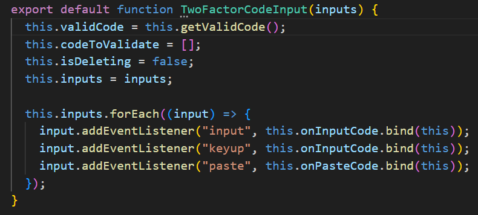

## Two factor code input

This application facilitates the input of a 4-digit security code for two-factor authorization.

 

## How it works?

The app works with a constructor function TwoFactorCodeInput, which expects the inputs from the app, to add event listeners, manipulate them and generates a random valid code based on the number of inputs.

_js/two-factor-code-input.mjs_

 

 

When a user enters a code, the onInput function is triggered by two events: input and keyup. The keyup event detects if the Backspace key is pressed, indicating input deletion or navigation to the previous input. If the input value is a number, onEnterDigit is called to update the codeToValidate property and focus on the next input if available.

 

 

 

Users can paste a code, but only in the first input and if the length of the pasted code is equal to or less than the number of inputs. Depending on the length, the next or the last input will be focused.

 

When the user clicks the verify button,the validateCode function compares the valid code with the entered code.

 

Additionally, users can view the valid code, and based on the validation outcome, they may receive a message or observe an error animation.

_js/index.js_

 
